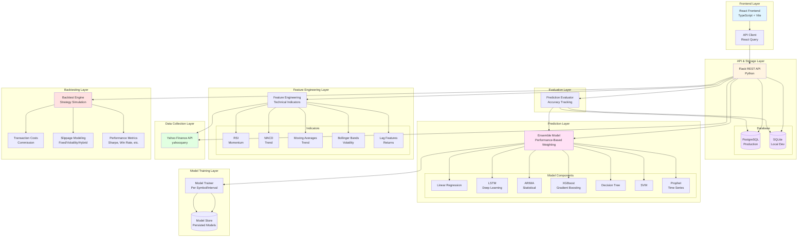
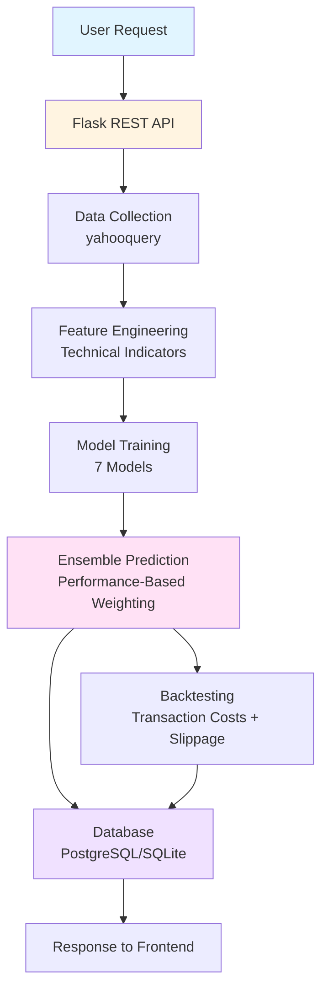

# Figure 1: System Architecture Diagram

## Mermaid Diagram (for LaTeX/Word)



## Textual Description (for Report)

**Figure 1: System Architecture**

The system follows a modular six-layer architecture:

**Layer 1 - Data Collection:** Yahoo Finance API (`yahooquery`) provides historical OHLCV data for multiple timeframes (5m, 15m, 1h, 4h, 1d, 1wk, 1mo).

**Layer 2 - Feature Engineering:** Raw price data is transformed into technical indicators (RSI, MACD, Moving Averages, Bollinger Bands) and derived features (lags, returns, rolling statistics) using the `ta` library.

**Layer 3 - Model Training:** Seven heterogeneous models are trained per symbol/interval combination and persisted to avoid unnecessary retraining. Models include LSTM (deep learning), XGBoost (gradient boosting), ARIMA and Prophet (statistical), Linear Regression, Decision Tree, and SVM (traditional ML).

**Layer 4 - Prediction Layer:** Ensemble model combines individual model predictions using performance-based weighting (calculated from historical evaluation data) with confidence-based fallback. Model weights automatically adapt as more evaluation data accumulates.

**Layer 5 - Backtesting Layer:** Simulates trading strategies with realistic market conditions including transaction costs (commission) and slippage modeling (fixed, volatility-based, or hybrid). Calculates performance metrics (Sharpe ratio, win rate, total return, maximum drawdown).

**Layer 6 - API & Storage Layer:** Flask REST API serves predictions and backtesting results. Dual-database approach: PostgreSQL for production scalability, SQLite for local development. Evaluation system tracks predictions over time and compares with actual prices.

**Data Flow:** User requests flow from React frontend → Flask API → Data collection → Feature engineering → Model training/prediction → Ensemble combination → Database storage → Response to frontend.

## Simplified Version (Alternative)



## LaTeX Code (for Overleaf/LaTeX)

```latex
\begin{figure}[h]
\centering
\begin{tikzpicture}[
    box/.style={rectangle, draw, rounded corners, minimum width=3cm, minimum height=1cm, text centered},
    layer/.style={rectangle, draw, dashed, rounded corners, minimum width=12cm, minimum height=2cm},
    arrow/.style={->, >=stealth, thick}
]

% Layer 1: Data Collection
\node[box] (yahoo) at (0,0) {Yahoo Finance API\\yahooquery};

% Layer 2: Feature Engineering
\node[box] (features) at (0,-2) {Feature Engineering\\Technical Indicators};

% Layer 3: Model Training
\node[box] (training) at (0,-4) {Model Training\\7 Heterogeneous Models};

% Layer 4: Prediction
\node[box] (ensemble) at (0,-6) {Ensemble Prediction\\Performance-Based Weighting};

% Layer 5: Backtesting
\node[box] (backtest) at (-3,-8) {Backtesting Engine\\Transaction Costs + Slippage};

% Layer 6: API & Storage
\node[box] (api) at (3,-8) {Flask REST API};
\node[box] (db) at (3,-10) {Database\\PostgreSQL/SQLite};

% Arrows
\draw[arrow] (yahoo) -- (features);
\draw[arrow] (features) -- (training);
\draw[arrow] (training) -- (ensemble);
\draw[arrow] (ensemble) -- (backtest);
\draw[arrow] (ensemble) -- (api);
\draw[arrow] (api) -- (db);
\draw[arrow] (backtest) -- (db);

\end{tikzpicture}
\caption{System Architecture - Six-Layer Modular Design}
\label{fig:system_architecture}
\end{figure}
```

## Key Components to Highlight

1. **Modularity:** Each layer can be developed and tested independently
2. **Data Flow:** Clear unidirectional flow from data collection to storage
3. **Dual Database:** Automatic switching between PostgreSQL (production) and SQLite (local)
4. **Performance-Based Weighting:** Dynamic ensemble weights based on historical accuracy
5. **Realistic Backtesting:** Includes both transaction costs and slippage modeling
6. **Model Persistence:** Trained models saved to avoid retraining

## Caption for Report

**Figure 1: System Architecture**

The system follows a modular six-layer architecture enabling independent development and testing. Data flows from Yahoo Finance API through feature engineering, model training, ensemble prediction, and backtesting layers before being stored in the database. The Flask REST API serves as the interface between frontend and backend components. The dual-database approach (PostgreSQL for production, SQLite for local development) ensures scalability while maintaining development simplicity.

